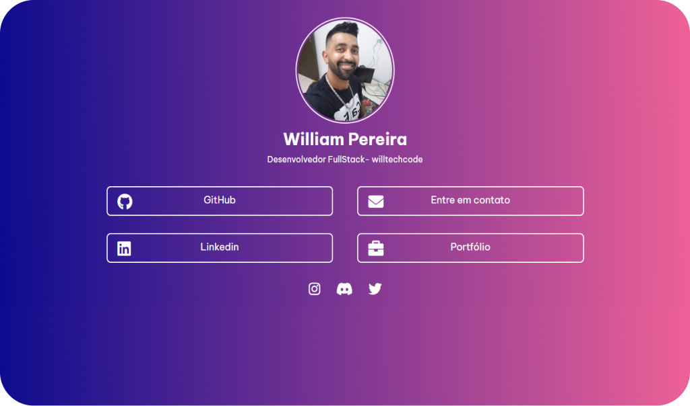
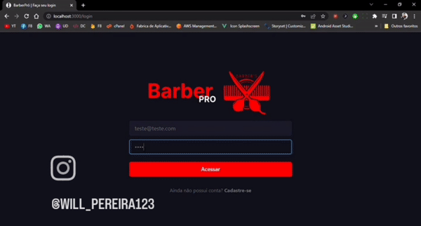

  

   
  

  

  
  
  

   
  

# :clipboard: Sobre o projeto

Sistema de barbearia baseada em um modelo SaaS, onde o barbeiro consegue usar de modo gratuito mas com limitações, onde ele assinando o modelo premium ele tem todas as funções liberadas.

Abaixo podemos ver o resultado final do projeto. Espero que gostem!

 

   
  

# 🔗 Acesse o site com o link abaixo.

- [BarberPró - O seu sistema profissional](https://barberpro.vercel.app/)

- [React.js](https://nodejs.org/en/)
- [Chakra-UI](https://getbootstrap.com/)
- [Styled-Components](https://styled-components.com/)
- [HTML](https://developer.mozilla.org/pt-BR/docs/Web/HTML)
- [CSS](https://developer.mozilla.org/pt-BR/docs/Web/CSS)

##

  
  

